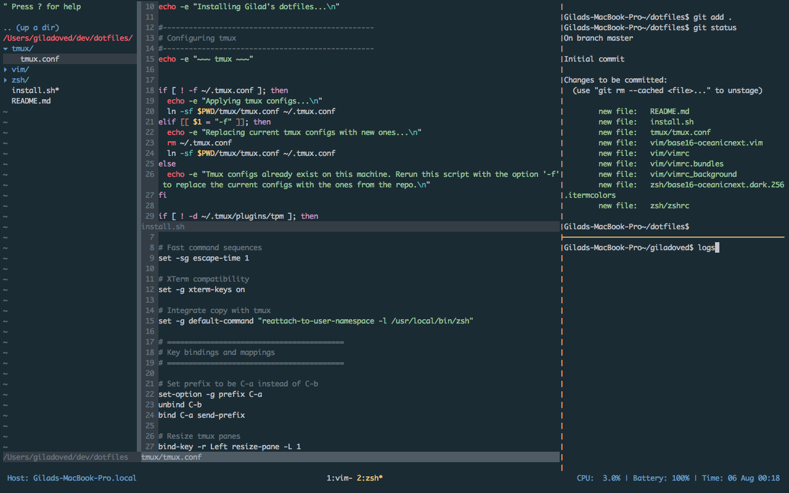

# My Dotfiles

These are dotfiles that I use to make my workflow most efficient and comfortable. Feel free to fork and customize!

### Screenshot

### tmux

- Prefix is set to CTRL-A. I mapped my CAPS button to CTRL for quick access.

- Smart pane switching to easily move between tmux/vim panes: Prefix-h,j,k,l.

- Panes are created with `-` (horizontal split) and `|` (vertical split).

- Resize panes using Prefix-H,J,K,L.

- Vim copy / pasting (in copy mode): Prefix-v to start, Prefix-y to copy, prefix-P (uppercase P) to paste.

### iTerm Settings

- For the same terminal color theme as vim: set the theme to `base16-oceanicnext.dark.256.itermcolors`

- Automatically join your running tmux session by sending the following text at start: `tmux attach -t mysession || tmux new -s mysession`

### Steps to adapt

1. Fork / clone the repo

2. Run the install shell script: `./install`
If you get an error, you might need to make the install script executable: `chmod u+x install.sh`

3. Install the tmux plugins by typing: Prefix-I

4. Open vim and enter: `:PlugInstall`
If you get errors installing the vim plugins, make sure you have installed the xcode dev tools: `xcode-select --install`

5. Restart your terminal

### Features
Leader-ff = FuzzyFind (CommandT plugin)

Leader-nt = directory file structure (NERDTree plugin)

Enjoy! ✌
